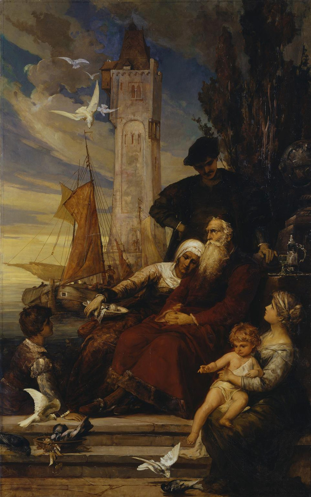

# Does the Storm Last? A Machine Learning Approach to Predict the Duration of Panic Volatility after Market Shocks
A leakage-safe machine learning framework to predict the duration of shock-induced panic volatility across energy, metals, agriculture, and equities (2000–2026). Utilizes 3-state Markov-switching models for regime detection and tree-based ensembles (XGBoost/Random Forest) to forecast whether market instabilities will resolve quickly or persist.

This project asks whether machine learning can predict how long market instability lasts after a major shock. The basic question is if at the day a crisis starts, we are to say anything useful about how long it will run?

The project compares several model families to see which ones work, whether they beat random-chance baselines, and which kinds of information carry signal. The features come from price movements, cross-asset information, and macroeconomic conditions. Where different models agree that a feature matters, that feature is treated as a more promising signal.

The aim is evidence on three points: whether crisis duration is predictable at all, which methods look most promising, and which signals drive predictions. The results are meant to support later research and to give policymakers, investors, and other stakeholders something to work with in periods of extreme uncertainty.

  

  > *„NACH DEM VOLLENDETEN WERK AUSRUHN, O SCHOENSTER GEDANKE,*
  > *JEDER BEGEHRT ES, DOCH WIE SELTEN GEWAEHRT ES DAS GLUECK.“*
  >  — Arthur Fitger (Hamburger Kunsthalle)

